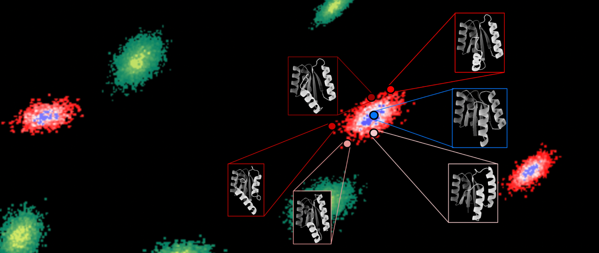

# Code for "An improved model for prediction of de novo designed proteins with diverse geometries"

Authors: Benjamin Orr*, Stephanie E. Crilly*, Deniz Akpinaroglu, Eleanor Zhu, Michael J. Keiser, Tanja Kortemme

[Paper](https://www.biorxiv.org/content/10.1101/2025.06.02.657515v1)

Data for this manuscript can be found on [zenodo](https://zenodo.org/records/16938925).

See instructions for running fine-tuned AF2 models in ft_models/ or on [zenodo](https://zenodo.org/records/15580792).

## Installation

Install from the repo root:

```bash
pip install .
```

Install with extra packages for AlphaFold2 fine-tuning (JAX/Haiku/Optax):

```bash
pip install .[finetune]
```

- Install PyRosetta separately to use PyRosetta-dependent functions in degree_of_reshaping/
- The fine-tuning extras install CPU wheels for JAX; follow JAX docs to install GPU-specific wheels.

## Overview

**Code for:**
1. Structural analysis of de novo designed proteins (especially diversity and reshaping of [LUCS](https://www.science.org/doi/10.1126/science.abc0881) (Loop-Helix-Loop Unit Combinatorial Sampling) designs)
2. Fine-tuning and transfer learning with AlphaFold2 (adapted from [Motmaen et al. 2022](https://www.pnas.org/doi/10.1073/pnas.2216697120))

**Structural analysis:**
- Compare design models to reference and predicted structures (AlphaFold2/3, RoseTTAFold2, ESMFold, etc.)
- Calculate protein structural diversity, similarity, and reshaping (helix RMSD, helix displacement and angle, RMSD, TM-score)
- Analyze helix geometry and diversity (e.g., binning helices by their centroid positions and directional components)
- Aggregate predicted structures' confidence metrics (pLDDT, pAE, pTM), structure-based metrics, and Rosetta metrics

**AlphaFold fine-tuning:**
- Fine-tune AlphaFold2 models on custom datasets
- Build and train classifier heads on AlphaFold2 for protein property prediction
- Inference with and without MSA/templates for classic and fine-tuned AlphaFold2 models 
- Evaluate predictions for structural and classification accuracy

Code for generating LUCS backbones can be found in [loop_helix_loop_reshaping](https://github.com/Kortemme-Lab/loop_helix_loop_reshaping)

Code for Rosetta-based sequence design and scoring can be found in [local_protein_sequence_design](https://github.com/Kortemme-Lab/local_protein_sequence_design)

## Directories

#### `alphafold_finetune/`
Tools for fine-tuning and transfer learning with AlphaFold2 models (adapted from [Motmaen et al. 2022](https://www.pnas.org/doi/10.1073/pnas.2216697120)) and analyzing predictions from both classic and fine-tuned models. Includes training scripts, prediction utilities, and analysis tools for evaluating model performance against ground truth (or, as in the publication, Rosetta-modeled) structures.

#### `data/`
Organization of data associated with the manuscript on zenodo and descriptions of data used in each manuscript figure.

#### `degree_of_reshaping/`
Analysis tools for calculating structural metrics for LUCS designs, e.g. helix RMSDs between Rosetta models and AlphaFold predictions, or between these models and reference structures (such as LUCS starting structures, before loop-helix-loop reshaping). Includes utilities for RMSD calculations, helix geometry analysis, and structural diversity calculations.

#### `env/`
.yml files containing dependencies for alphafold fine-tuning and Rosetta/structure-based analysis.

#### `ft_models/`
Instructions for running fine-tuned AF2 models from the paper using localcolabfold or Google Colab.

#### `helix_vectors/`
Tools for calculating and analyzing 6D helix vectors (3D position + 3D direction) to characterize helix geometry in protein structures. Used for quantifying and visualizing helix diversity through helix position and orientation.

#### `tests/`
Unit tests for configuration management, RMSD calculations, and structural alignment.
